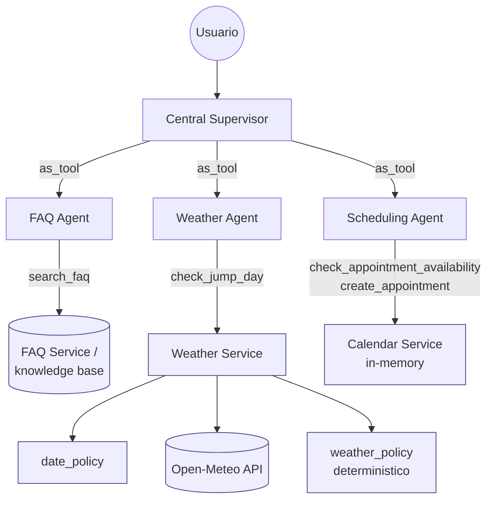
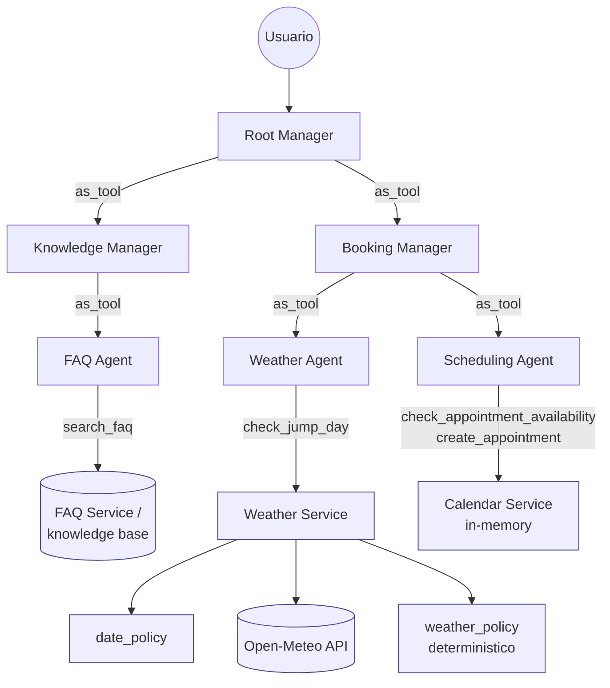
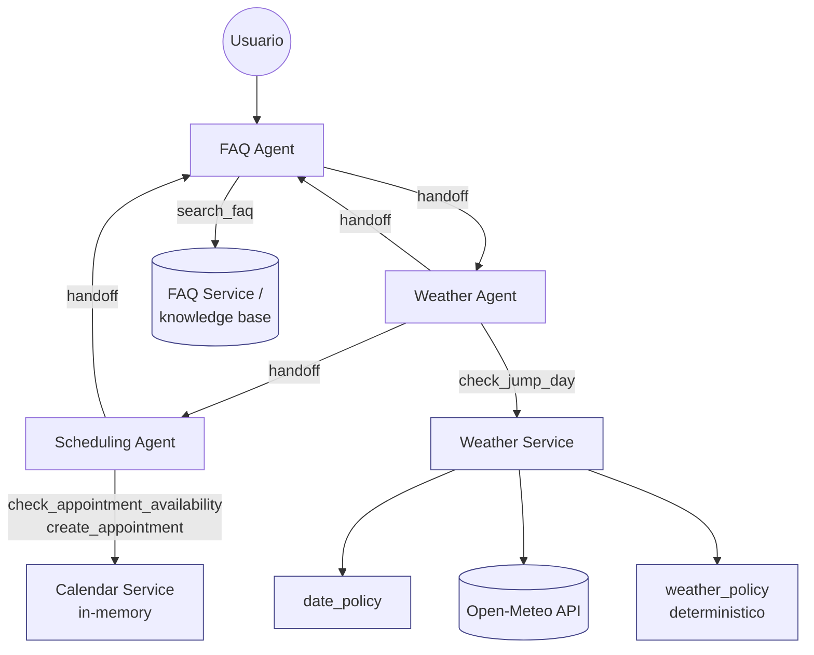

# Diagramas de arquitectura

Fuente editable en Mermaid (`.mmd`, una por arquitectura), exportada tambien
como PNG (`centralized.png`, `hierarchical.png`, `decentralized.png`) para
verlas sin un visor Mermaid. Este archivo ademas incrusta las mismas tres
fuentes en bloques ` ```mermaid ` para que se rendericen directamente en
GitHub/GitLab.

## Centralizada



## Jerárquica



## Descentralizada



Nota de anti-bypass (aplica a las tres, especialmente relevante en la
descentralizada por sus ciclos de handoffs): `create_appointment` exige que
`context.jump_assessment` exista y corresponda a la fecha solicitada,
independientemente de la ruta de `as_tool()`/handoffs que se haya seguido
para llegar ahi.
